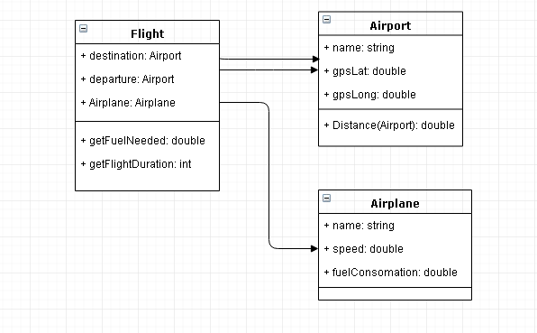

# Flight App

This is a simple test application developed by .net core Rest API,  angular 7 and material design in front.

### Back end Architecture
The API was re-factored to 4 Components
- FlighApp.model ho represents the entities of our application
- FlighApp.Dal: A data access layer that exposes all operations we need on the database
- FlighApp.Business: the Business logic of the application
- FlighApp.Web : Exposes application services through rest API

We used dependency injection for the communication between components
In the test project we developed a mock for each service to be tested independently 
### Model class diagram


### Prerequisites

```
- Visual studio and .net core SDK
- nodeJs 8+
- Angular CLI v7
```

### Installing

Clone the repo 
Open  solution FilighApp/FlighApp.sln by visual studio
From package manager console select FlighApp.Dal project and run  "update-database"


For the front application run :
```
cd FlightAppAngular
npm i
ng serve
```